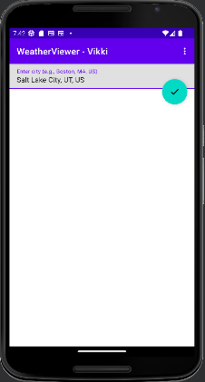
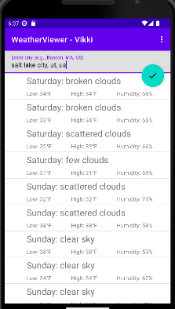

# Weather-App-Project
I created a Weather Viewer App using OpenWeatherMap.org REST web services. The app receives data in JSON. This is done in Kotlin using Android Studio.

Class: INFO 4420 - Mobile App Development

The Weather Viewer app uses the free OpenWeatherMap.org REST web services to obtain a specified city's 16-day weather forecast. The app receives the weather data in JSON (JavaScript Object Notation) data format. The list of weather data is displayed in a ListView. 

Results:

